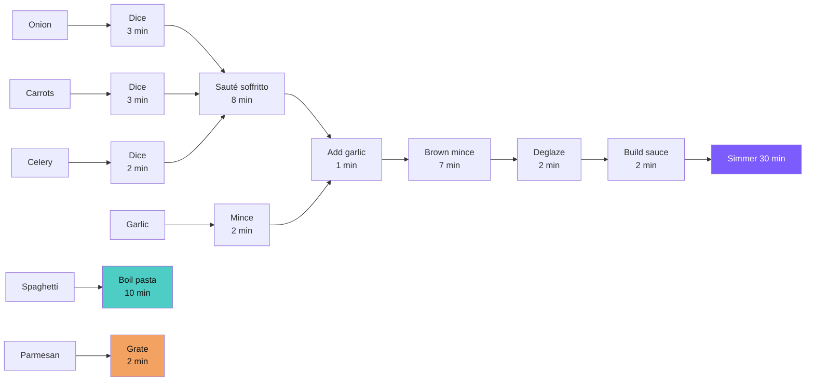

# Recipe Visualizer

**Recipes are graphs, not lists.** This app transforms recipe text into interactive cooking guides that schedule tasks in parallel and fill idle time, so dinner is ready sooner.


## The problem with traditional recipes

A traditional Spaghetti Bolognese recipe reads as a numbered list: dice onions, sauté vegetables, brown meat, simmer sauce, boil pasta, serve. But it hides the structure underneath:

- The sauce simmers for **30 minutes** with only 3 minutes of active stirring. That's 27 minutes of dead time you could use to boil pasta or grate Parmesan.
- The cutting board is needed for four prep tasks, but they don't all have to happen before cooking starts.
- The recipe says "75 minutes" but an experienced cook finishes in **62**. Where do those 13 minutes go?

Experienced cooks do this in their heads. They read ahead, spot idle windows, and interleave tasks. Beginners follow step 1, then step 2, then step 3, and dinner takes longer than it needs to.

**What if the recipe itself could figure out the optimal schedule?**

## How it works

The app models each recipe as a **directed acyclic graph** (DAG). Nodes are operations, edges are dependencies, and idle windows are where the optimizer finds time to save:



**Boil pasta** and **grate parmesan** don't depend on the simmer phase. They can run in parallel, and the optimizer finds these gaps automatically.

### Two execution modes

| Mode | Strategy | Bolognese time |
|------|----------|----------------|
| **Relaxed** | All prep upfront, then cooking in sequence | 75 min |
| **Optimized** | Prep distributed into idle windows during cooking | 62 min |

In **relaxed mode**, you chop everything first, then cook. Low stress, no multitasking.

In **optimized mode**, the app tells you: *"The sauce is simmering. You have 27 minutes of idle time. Boil the pasta and grate the Parmesan now."* Same recipe, 17% less wall-clock time.

## Features

- **Two cooking modes** — relaxed (all prep first) or optimized (prep during idle windows)
- **Step-by-step cooking** — focus card UI shows one task at a time with context about what's running in the background
- **Built-in timers** — start a timer for any passive operation
- **Screen wake lock** — screen stays on while cooking (no flour-covered unlock)
- **Servings adjuster** — scale ingredients and operation times up or down
- **Offline-ready PWA** — install to your home screen, works without internet
- **Dark theme** — easy on the eyes in kitchen lighting
- **i18n** — English and Estonian; add a JSON file for your language
- **Search and filter** — browse by tag, difficulty, or free text
- **Self-contained HTML** — each recipe page is a standalone file you can email to someone
- **Claude Code plugin** — import recipes from URLs, images, or pasted text with AI assistance

## Quick start

```bash
git clone https://github.com/lauriliivamagi/recipes.git
cd recipes
npm install
npm run build
```

Open `site/index.html` in your browser, or run `npm run dev` for live development with hot reload.

> **Requires** Node.js 22+.

## Architecture

The codebase uses **vertical slice architecture** with domain-driven design. Each domain concern is a self-contained slice with its own types, logic, and tests.

```
  Recipe JSON             Vite Build Pipeline            Output
  ───────────             ──────────────────             ──────
  recipes/                src/build/                     site/
  └─ italian/               vite-plugin-recipes.ts       ├─ index.html
     ├─ spaghetti-          ├─ reads recipe JSON         ├─ italian/
     │  bolognese.json      ├─ validates DAG             │  ├─ spaghetti-bolognese.html
     └─ classic-            ├─ computes schedules        │  └─ classic-lasagne.html
        lasagne.json        └─ injects into HTML         ├─ assets/*.js (bundled Lit)
                                                         ├─ app.webmanifest
  src/domain/             src/ui/                        └─ sw.js
  ├─ recipe/              ├─ catalog/
  ├─ schedule/            ├─ recipe/
  ├─ scaling/             ├─ overview/
  ├─ catalog/             ├─ cooking/
  └─ cooking/             └─ state/
```

**Domain slices** (pure TypeScript, no DOM dependencies):

- `recipe/` — types, Zod schema, parser, ingredient resolution
- `schedule/` — DAG validation, toposort, critical path, relaxed/optimized scheduling
- `scaling/` — unit conversion, temperature, rounding, serving scaling
- `catalog/` — recipe search and tag filtering
- `cooking/` — step navigation, timer lifecycle

**UI layer** — Lit v3 web components with XState v5 state machine for the cooking flow.

## Recipe data format

Recipes are JSON files validated against [`config/recipe-schema.json`](config/recipe-schema.json). Here's the essential structure:

```json
{
  "meta": {
    "title": "Spaghetti Bolognese",
    "slug": "spaghetti-bolognese",
    "language": "en",
    "tags": ["italian", "pasta", "weeknight"],
    "servings": 4,
    "totalTime": { "relaxed": 75, "optimized": 62 },
    "difficulty": "easy"
  },
  "ingredients": [
    { "id": "onion", "name": "Onion", "quantity": { "min": 1, "unit": "whole" }, "group": "vegetables" }
  ],
  "equipment": [
    { "id": "large-pan", "name": "Large heavy-bottomed pan", "count": 1 }
  ],
  "operations": [
    {
      "id": "dice-onion",
      "type": "prep",
      "action": "dice",
      "inputs": ["onion"],
      "equipment": { "use": "cutting-board", "release": true },
      "time": 3,
      "activeTime": 3,
      "details": "Finely dice the onion"
    },
    {
      "id": "simmer-sauce",
      "type": "cook",
      "action": "simmer",
      "inputs": ["build-sauce"],
      "time": 30,
      "activeTime": 3,
      "scalable": false,
      "heat": "low",
      "output": "sauce"
    }
  ],
  "subProducts": [
    { "id": "sauce", "name": "Bolognese Sauce", "finalOp": "simmer-sauce" }
  ],
  "finishSteps": [
    { "action": "toss", "inputs": ["simmer-sauce", "boil-pasta"], "details": "Combine and serve" }
  ]
}
```

**Key concepts:**

| Field | What it does |
|-------|-------------|
| `inputs` | Creates DAG edges — reference ingredient IDs or previous operation IDs |
| `time` vs `activeTime` | A 30-min simmer with 3 min active creates a 27-min idle window the optimizer can fill |
| `equipment.release` | `true` = equipment becomes available; `false` = stays occupied for chained operations |
| `scalable` | `false` means time doesn't change with servings (simmering, baking, resting) |
| `subProducts` | Named intermediate results (sauce, dough, filling) the UI can label and track |

## Adding recipes

### With Claude Code

If you have the [Claude Code CLI](https://docs.anthropic.com/en/docs/claude-code) with this repo's plugin:

```bash
/recipe-import https://example.com/my-recipe    # from a URL
/recipe-import path/to/photo.jpg                 # from a cookbook photo
/recipe-import                                   # paste text interactively
```

The plugin parses the text, converts to metric, validates the DAG, and generates HTML. It shows a side-by-side comparison before writing the file.

### Manually

1. Create `recipes/<cuisine>/<slug>.json` (use [`spaghetti-bolognese.json`](recipes/italian/spaghetti-bolognese.json) as a template)
2. Define ingredients, equipment, and operations
3. Wire up `inputs` arrays to form the DAG
4. Run `npm run build:recipe -- spaghetti-bolognese` (replace with your slug)
5. Open `site/<cuisine>/<slug>.html` in your browser

### Batch import

Drop recipe files (markdown, PDF, images) into `inbox/` and run `/recipe-inbox`.

### Suggested tags

Tags are freeform, but the app recognizes these categories from [`config/tags.json`](config/tags.json):

| Category | Tags |
|----------|------|
| Cuisine | italian, asian, mexican, french, indian, mediterranean, american, estonian, nordic |
| Meal | breakfast, lunch, dinner, snack, dessert |
| Type | pasta, soup, salad, stew, baking, grilling, stir-fry, roast |
| Effort | weeknight, weekend, quick, meal-prep |
| Dietary | vegetarian, vegan, gluten-free, dairy-free, low-carb |

## Project structure

```
src/
  domain/                 Pure TypeScript domain logic (no DOM)
    recipe/               types, Zod schema, parser, ingredient resolution
    schedule/             DAG validation, toposort, critical path, scheduling
    scaling/              unit conversion, rounding, serving scaling
    catalog/              search and tag filtering
    cooking/              step navigation, timer lifecycle
  ui/                     Lit v3 web components
    catalog/              <catalog-page>, <search-bar>, <tag-filters>, <recipe-card>
    recipe/               <recipe-page>, <recipe-header>, <servings-adjuster>, <view-tabs>
    overview/             <overview-view>, <mode-toggle>, <equipment-summary>, <phase-card>
    cooking/              <cooking-view>, <focus-card>, <timer-button>, <nav-buttons>
    state/                XState v5 machine, wake lock, audio, persistence
  build/                  Vite plugin and i18n loader
  entries/                Browser entry points (catalog.ts, recipe.ts)
recipes/                  JSON recipe sources, organized by cuisine
config/
  ├─ recipe-schema.json   JSON Schema (draft 2020-12) for recipe validation
  ├─ unit-conversions.json  metric/imperial conversion tables
  ├─ ingredient-densities.json  volume-to-weight (g per cup) for scaling
  ├─ tags.json            suggested tag taxonomy
  └─ preferences.json     default servings, language, dietary preferences
templates/                HTML shells + PWA assets + i18n language packs
e2e/                      Playwright E2E tests
site/                     built output (deployed via CI)
.github/workflows/
  └─ deploy.yml           GitHub Actions → GitHub Pages (test + deploy)
.claude-plugin/           Claude Code integration (commands + skills)
```

## Tech stack

| Layer | Technology |
|-------|-----------|
| Language | TypeScript (strict mode) |
| Build | Vite 8 with custom recipe plugin |
| UI | Lit v3 web components |
| State | XState v5 state machine |
| Data | JSON with Zod validation |
| Optimizer | Custom DAG scheduler (topological sort, critical path DP, greedy packing) |
| Styling | CSS custom properties, `clamp()` fluid typography, scoped component styles |
| PWA | Service worker (stale-while-revalidate), web app manifest, Wake Lock API |
| Unit tests | Vitest (74 tests) |
| E2E tests | Playwright (20 tests) |
| i18n | JSON string bundles with deep-merge fallback |
| CI/CD | GitHub Actions → GitHub Pages |
| AI tooling | Claude Code plugin for recipe parsing and import |

## Roadmap

- [ ] More recipes (only 2 Italian so far — the schema supports any cuisine)
- [ ] Shopping list generator across multiple recipes
- [ ] Print-friendly CSS stylesheet
- [ ] More languages (i18n framework is ready — add a JSON file)
- [ ] Nutrition estimates per ingredient
- [ ] Voice control for hands-free step navigation
- [ ] Equipment timeline (Gantt chart showing pan/oven utilization)
- [ ] Recipe sharing via QR codes

## Contributing

Contributions are welcome. The codebase is organized as vertical slices so you can work on one area without understanding the whole system.

### Setup

```bash
git clone https://github.com/lauriliivamagi/recipes.git
cd recipes
npm install
```

### Development workflow

```bash
npm run dev          # Vite dev server with hot reload
npm run typecheck    # TypeScript strict mode check
npm test             # Vitest unit tests (74 tests)
npm run test:e2e     # Playwright E2E tests (20 tests, requires npm run build first)
npm run build        # Production build to site/
npm run preview      # Serve production build locally
```

### Where to contribute

- **Add recipes** — Create `recipes/<cuisine>/<slug>.json` following the schema. See [spaghetti-bolognese.json](recipes/italian/spaghetti-bolognese.json) as a template.
- **Add a language** — Copy `templates/i18n/en.json` to `templates/i18n/<code>.json` and translate the strings.
- **Domain logic** — Pure TypeScript in `src/domain/`. Each slice has co-located `.test.ts` files. Run `npm test` to verify.
- **UI components** — Lit web components in `src/ui/`. Each component is a self-contained `.ts` file with scoped styles.
- **E2E tests** — Playwright specs in `e2e/`. Run `npm run build && npm run test:e2e`.

### Code conventions

- Domain modules have **zero DOM dependencies** — they work in both Node.js and the browser.
- Unit tests are **co-located** with source files (`foo.ts` has `foo.test.ts` next to it).
- Imports use **`.js` extensions** (TypeScript + ES modules convention for Vite).
- CSS uses the **design tokens** defined in `src/ui/shared/styles.ts`.

## License

[MIT](LICENSE)
