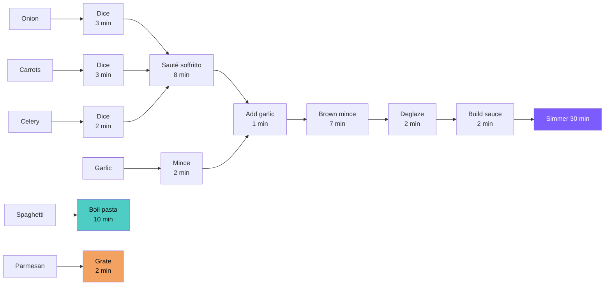

# Recipe Visualizer


**Recipes are graphs, not lists.** This app models each recipe as a directed acyclic graph, finds tasks that can run in parallel, and fills idle time so dinner is ready sooner.

[Live demo](https://lauriliivamagi.github.io/recipes/)


## The problem with traditional recipes

A Bolognese recipe reads as a numbered list, but it hides real structure:

- The sauce simmers for 30 minutes with only 3 minutes of active stirring. That's 27 minutes of dead time you could use to boil pasta or grate Parmesan.
- The cutting board is needed for four prep tasks, but they don't all have to happen before cooking starts.
- The recipe says "75 minutes" but an experienced cook finishes in 62. Where do those 13 minutes go?

## How it works

Nodes are operations, edges are dependencies, and idle windows are where the optimizer saves time:



Boiling pasta and grating Parmesan don't depend on the simmer phase. They can run in parallel, and the scheduler finds these gaps automatically.

The app has two modes. Relaxed mode puts all prep first, then cooks sequentially — 75 minutes for this Bolognese. Optimized mode distributes prep into idle windows during cooking and finishes in 62 minutes. Same recipe, 17% less wall-clock time.


## What you get while cooking

- Step-by-step focus cards show one task at a time, with background tasks visible in an awareness bar
- Built-in timers for any passive operation (simmering, resting, baking)
- Screen wake lock — your screen stays on, no flour-covered unlock
- Servings adjuster that scales ingredients and operation times
- Offline-ready PWA — install to your home screen, works without internet
- Dark theme for kitchen lighting
- Search, filter by tag, or browse by difficulty


## Quick start

```bash
git clone https://github.com/lauriliivamagi/recipes.git
cd recipes
npm install
npm run dev      # dev server with hot reload
npm run build    # production build to site/
```

> Requires Node.js 22+.

## Architecture

Vertical slice architecture with domain-driven design. Each domain concern is a self-contained slice with its own types, logic, and tests.

```text
  Recipe JSON                    Vite Build Pipeline            Output
  ───────────                    ──────────────────             ──────
  packages/build/recipes/        packages/build/src/            site/
  └─ italian/                      vite-plugin-recipes.ts       ├─ index.html
     ├─ spaghetti-                 ├─ reads recipe JSON         ├─ italian/
     │  bolognese.json             ├─ validates DAG             │  ├─ spaghetti-bolognese.html
     └─ classic-                   ├─ computes schedules        │  └─ classic-lasagne.html
        lasagne.json               └─ injects into HTML         ├─ assets/*.js (bundled Lit)
                                                                ├─ app.webmanifest
  packages/domain/src/           packages/ui/src/               └─ sw.js
  ├─ recipe/                     ├─ catalog/
  ├─ schedule/                   ├─ recipe/
  ├─ scaling/                    ├─ overview/
  ├─ catalog/                    ├─ cooking/
  └─ cooking/                    └─ state/
```

Domain logic is pure TypeScript with Zod validation — no DOM dependencies. The UI layer uses Lit v3 web components with an XState v5 state machine for the cooking flow. Built with Vite 8, tested with Vitest (unit) and Playwright (E2E). CI deploys to GitHub Pages on every push to master.

<details>
<summary>Full project tree</summary>

```text
packages/
  domain/                 @recipe/domain — pure TypeScript domain logic
    src/
      recipe/             types, Zod schema, parser, ingredient resolution
      schedule/           DAG validation, toposort, critical path, scheduling
      scaling/            unit conversion, rounding, serving scaling
      catalog/            search and tag filtering
      cooking/            step navigation, timer lifecycle
  ui/                     @recipe/ui — Lit v3 web components
    src/
      catalog/            <catalog-page>, <search-bar>, <tag-filters>, <recipe-card>
      recipe/             <recipe-page>, <recipe-header>, <servings-adjuster>, <view-tabs>
      overview/           <overview-view>, <mode-toggle>, <equipment-summary>, <phase-card>
      cooking/            <cooking-view>, <focus-card>, <timer-button>, <nav-buttons>
      state/              XState v5 machine, wake lock, audio, persistence
  build/                  @recipe/build — Vite plugin, i18n, data
    src/                  vite-plugin-recipes.ts, i18n loader, schema generator
    recipes/              JSON recipe sources, organized by cuisine
    state/                household state (pool, themes, staples)
    templates/            HTML shells + i18n language packs
  extension/              @recipe/extension — Chrome extension for recipe import
    evals/                PromptFoo AI evaluation suite for recipe parsing
config/                   JSON schemas + lookup tables (shared across packages)
site/                     built output (deployed via CI)
```

</details>

## Recipe data format

Each recipe is a JSON file validated against [`config/recipe-schema.json`](config/recipe-schema.json):

```json
{
  "meta": {
    "title": "Spaghetti Bolognese",
    "slug": "spaghetti-bolognese",
    "tags": ["italian", "pasta", "weeknight"],
    "servings": 4,
    "totalTime": { "relaxed": 75, "optimized": 62 },
    "difficulty": "easy"
  },
  "ingredients": [{ "id": "onion", "name": "Onion", "quantity": { "min": 1, "unit": "whole" }, "group": "vegetables" }],
  "operations": [
    {
      "id": "simmer-sauce",
      "type": "cook",
      "action": "simmer",
      "inputs": ["build-sauce"],
      "time": 30,
      "activeTime": 3,
      "scalable": false,
      "heat": "low",
      "output": "sauce"
    }
  ]
}
```

| Field                  | What it does                                                                          |
| ---------------------- | ------------------------------------------------------------------------------------- |
| `inputs`               | Creates DAG edges — reference ingredient IDs or previous operation IDs                |
| `time` vs `activeTime` | A 30-min simmer with 3 min active creates a 27-min idle window the optimizer can fill |
| `equipment.release`    | `true` = equipment freed after this step; `false` = stays occupied                    |
| `scalable`             | `false` means time doesn't change with servings (simmering, baking, resting)          |
| `subProducts`          | Named intermediate results (sauce, dough, filling) the UI can label and track         |

## Adding recipes

1. Create `packages/build/recipes/<cuisine>/<slug>.json` (use [`spaghetti-bolognese.json`](packages/build/recipes/italian/spaghetti-bolognese.json) as a template)
2. Define ingredients, equipment, and operations
3. Wire up `inputs` arrays to form the DAG
4. Run `pnpm build`
5. Open `site/<cuisine>/<slug>.html` in your browser

There's also a Chrome extension (`packages/extension/`) that imports recipes from URLs, images, or pasted text using AI.

<details>
<summary>Suggested tags</summary>

Tags are freeform, but the app recognizes these categories from [`config/tags.json`](config/tags.json):

| Category | Tags                                                                               |
| -------- | ---------------------------------------------------------------------------------- |
| Cuisine  | italian, asian, mexican, french, indian, mediterranean, american, estonian, nordic |
| Meal     | breakfast, lunch, dinner, snack, dessert                                           |
| Type     | pasta, soup, salad, stew, baking, grilling, stir-fry, roast                        |
| Effort   | weeknight, weekend, quick, meal-prep                                               |
| Dietary  | vegetarian, vegan, gluten-free, dairy-free, low-carb                               |

</details>

## Roadmap

- [ ] More recipes (8 so far across Italian and Estonian)
- [ ] Shopping list generator across multiple recipes
- [ ] Print-friendly CSS
- [ ] More languages (i18n framework is ready — add a JSON file)
- [ ] Nutrition estimates per ingredient
- [ ] Voice control for hands-free step navigation
- [ ] Equipment timeline (Gantt chart showing pan/oven utilization)

## Contributing

```bash
npm run dev          # Vite dev server with hot reload
npm run typecheck    # TypeScript strict mode
npm test             # Vitest unit tests
npm run test:e2e     # Playwright E2E (requires build first)
npm run build        # Production build to site/
npm run preview      # Serve production build locally
```

Where to help:

- Add recipes — create `packages/build/recipes/<cuisine>/<slug>.json` following the schema
- Add a language — copy `packages/build/templates/i18n/en.json`, translate, save as `<code>.json`
- Domain logic — pure TypeScript in `packages/domain/src/`, co-located `.test.ts` files
- UI components — Lit web components in `packages/ui/src/`, self-contained with scoped styles
- E2E tests — Playwright specs in `e2e/`

## License

[MIT](LICENSE)
